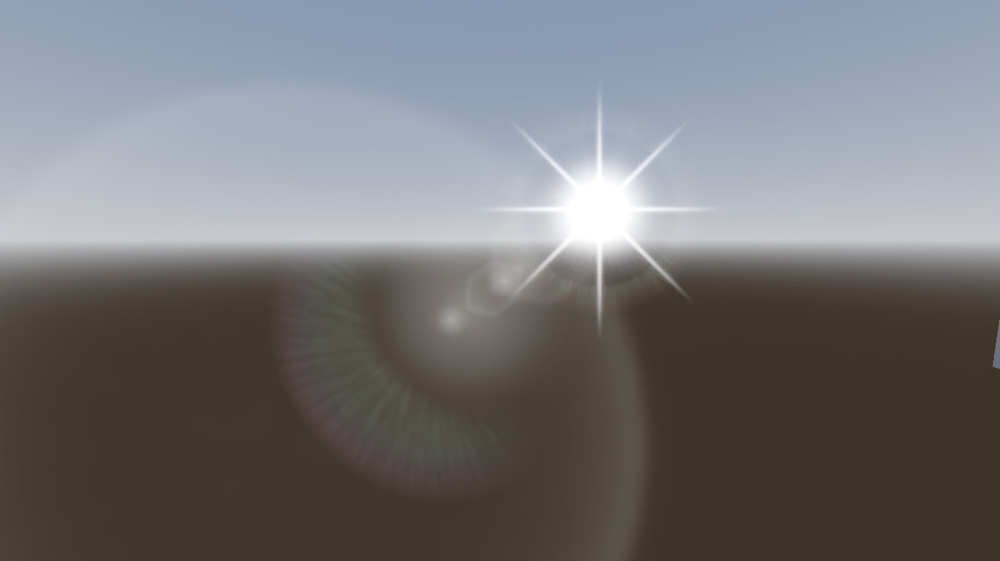
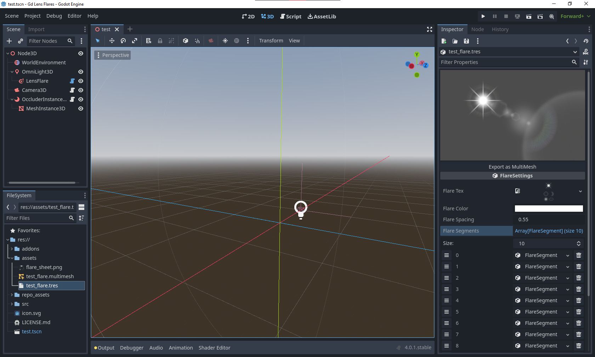

# Lens Flares for your Godot 4.0.
Add texture atlas based Lens Flares to any Godot 4.0 project!

### Features:
* Customizable Lens Flare resources, which export to a MultiMesh Resource.
* Uses MultiMeshes to make each lens flare render in one draw call.
* Can use Godot 4.0's occlusion culling system or raycast based occlusion detection.

### Screenshots

